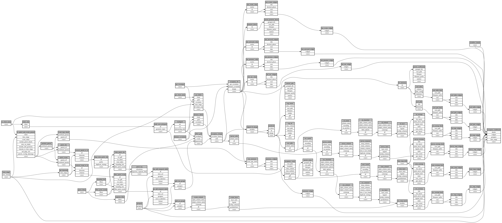

```
# AUTOGENERATED BY ECOSCOPE-WORKFLOWS; see fingerprint in README.md for details

```

```yaml
# fingerprint:
artifacts_sha256_basic: 653af0021f850af557027e325c2eef2db2d6f34d5b7b3e2df6b06cc925877498
artifacts_sha256_strict: 5a12f5182c2fb93561a689fc9f537e94714ec552dc47d587606bf615afa858c6
installed_requirements:
- channel: https://repo.prefix.dev/ecoscope-workflows/
  name: ecoscope-platform
  version: {version: ==2.25.1}
- channel: conda-forge
  name: pydeck
  version: {version: ==0.9.2}
params_sha256: 659384f19e46f81bf9af26f5e10098247b27466dc481314c481ba8ceba07b695
spec_sha256: 053b334d428905709dc06419b5212fa6b4b07d05cfddd70a58429edac683fc3a

```

# ecoscope-workflows-occupancy-model-workflow


